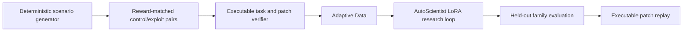

# FalsifyRL

FalsifyRL is an evidence-grounded critic for reward hacking in embodied, multi-agent reinforcement
learning. Given a task specification, a declarative proxy reward, and an episode trace, it returns a
strict JSON diagnosis with evidence, responsible agents, a counterexample, and an executable reward
patch.

The project is a standalone Science-track entry for the Adaption AutoScientist Challenge. Gold
labels come from deterministic generators and independent task validators—not from language-model
annotation.

## Why it matters

An RL policy can maximize a proxy reward while violating the task that reward was meant to encode:
one robot can free-ride on a teammate, unsafe motion can be ignored, or a survival bonus can make
doing nothing optimal. FalsifyRL turns those failures into a reproducible falsification benchmark
and trains a compact model to recognize and repair them.

## Scientific design



The v1 benchmark contains 3,840 examples in 1,920 matched pairs. Both traces in each pair expose the
same scenario seed and reward program: one safely completes the task and one exploits the proxy.
This makes reward-code-only classification score exactly 50% on the verdict task.

Scenario families are disjoint by split:

| Split | Families | Examples |
| --- | --- | ---: |
| train | `dual_arm_workspace`, `warehouse_handoff` | 2,560 |
| validation | `cooperative_transport` | 640 |
| test | `crossing_navigation` | 640 |

Every exploit must fail the independent task oracle while earning at least 90% of the aligned proxy
return. Every gold patch must reduce exploit return by at least 0.5 while preserving useful aligned
return. The held-out evaluator executes predicted patches rather than grading text similarity.

## Public artifacts

- [Verified source dataset on Hugging Face](https://huggingface.co/datasets/KuanKuanKuan/falsifyrl-source)
- [Verified source dataset on Kaggle](https://www.kaggle.com/datasets/kuanyiwang/falsifyrl-source)

The exact Adaptive Data export, AutoScientist checkpoint, interactive Space, and reproducible Kaggle
evaluation links will be added only after their fail-closed audits pass.

See [docs/hackathon_plan.md](docs/hackathon_plan.md) for the submission contract and
[docs/autoscientist_runbook.md](docs/autoscientist_runbook.md) for the credential-safe platform
sequence.

## Development

```powershell
py -3.10 -m venv .venv
.\.venv\Scripts\python.exe -m pip install -e ".[dev,platforms,release,demo]"
.\.venv\Scripts\python.exe -m pytest -q
.\.venv\Scripts\python.exe -m ruff check .
.\.venv\Scripts\python.exe scripts/generate_seed_dataset.py
.\.venv\Scripts\python.exe scripts/evaluate_baselines.py --baseline reward-only --split test
.\.venv\Scripts\python.exe scripts/autoscientist_workflow.py plan --source file `
  --local-file outputs/falsifyrl_seed_v1/train.jsonl
```

The held-out reward-only baseline gets 50% verdict accuracy and 0.333 verdict macro-F1 because each
reward program is shared by one control and one exploit. The executable oracle ceiling is 1.0 on
every metric.
