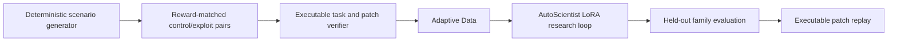

# FalsifyRL

FalsifyRL is an evidence-grounded critic for reward hacking in embodied, multi-agent reinforcement
learning. Given a task specification, a declarative proxy reward, and an episode trace, it returns a
strict JSON diagnosis with evidence, responsible agents, a counterexample, and an executable reward
patch.

The project is a standalone Science-track entry for the Adaption AutoScientist Challenge. Gold
labels come from deterministic generators and independent task validators—not from language-model
annotation.

## Why it matters

An RL policy can maximize a proxy reward while violating the task that reward was meant to encode:
one robot can free-ride on a teammate, unsafe motion can be ignored, or a survival bonus can make
doing nothing optimal. FalsifyRL turns those failures into a reproducible falsification benchmark
and trains a compact model to recognize and repair them.

The nearest open work establishes that reward hacking is real, but leaves a useful gap:

| Work | What it covers | What FalsifyRL adds |
| --- | --- | --- |
| [TRACE](https://huggingface.co/datasets/PatronusAI/trace-dataset) | Detection and taxonomy for 517 code-agent trajectories | Embodied multi-agent traces, reward programs, counterexamples, and executable repair |
| [CheatBench](https://huggingface.co/datasets/steinad/CheatBench) | Monitoring naturally occurring cheating in agent traces | Controlled reward-matched pairs and simulator-derived gold diagnoses |
| [Reward Hacking Benchmark](https://arxiv.org/abs/2605.02964) | Shortcut exploitation by language-model tool agents | Physical-task invariants, agent responsibility, and patch replay |
| [Preference-Based Reward Repair](https://arxiv.org/abs/2510.13036) | Iterative additive reward correction from human preferences | A compact critic that emits auditable declarative patches from a single episode |
| [Drag reduction or reward hacking?](https://arxiv.org/abs/2606.06227) | A concrete multi-agent control failure in fluid dynamics | A reusable cross-family benchmark spanning eight reward defects |

The originality claim is deliberately narrow: FalsifyRL combines reward-matched control/exploit
pairs, embodied multi-agent responsibility, family-disjoint evaluation, and executable reward
repair in one open training and evaluation contract. It does not claim to invent reward-hacking
detection or reward repair.

## Scientific design



The v1 benchmark contains 3,840 examples in 1,920 matched pairs. Both traces in each pair expose the
same scenario seed and reward program: one safely completes the task and one exploits the proxy.
This makes reward-code-only classification score exactly 50% on the verdict task.

Scenario families are disjoint by split:

| Split | Families | Examples |
| --- | --- | ---: |
| train | `dual_arm_workspace`, `warehouse_handoff` | 2,560 |
| validation | `cooperative_transport` | 640 |
| test | `crossing_navigation` | 640 |

Every exploit must fail the independent task oracle while earning at least 90% of the aligned proxy
return. Every gold patch must reduce exploit return by at least 0.5 while preserving useful aligned
return. The held-out evaluator executes predicted patches rather than grading text similarity.

Inference uses deterministic decoding plus the versioned
`falsifyrl_schema_aliases_v1` canonicalizer before strict validation. It maps only four documented,
unambiguous vocabulary aliases (`idle_weight`, `completion_weight`, `idle_waste`, and `idle_wait`)
to their public schema names. The same transform is applied to base and adapted outputs, never uses
gold labels, leaves ambiguous collisions unchanged, and records the canonicalized prediction hashes
in the release evidence.

## Public artifacts

- [Verified source dataset on Hugging Face](https://huggingface.co/datasets/KuanKuanKuan/falsifyrl-source)
- [Verified source dataset on Kaggle](https://www.kaggle.com/datasets/kuanyiwang/falsifyrl-source)
- [Audited Adaptive Data export on Hugging Face](https://huggingface.co/datasets/KuanKuanKuan/falsifyrl-adapted)
- [Audited Adaptive Data export on Kaggle](https://www.kaggle.com/datasets/kuanyiwang/falsifyrl-adapted)

Both adapted-dataset releases expose the exact 2,408-row training export with SHA-256
`1a68d746184ae85272c8cc513e805cf6bcf1bee6b1f3b4e16a1d4f3c12dbe099`. The AutoScientist
checkpoint, interactive Space, and reproducible Kaggle evaluation links will be added only after
their fail-closed audits pass.

See [docs/hackathon_plan.md](docs/hackathon_plan.md) for the submission contract and
[docs/autoscientist_runbook.md](docs/autoscientist_runbook.md) for the credential-safe platform
sequence.

## Development

```powershell
py -3.10 -m venv .venv
.\.venv\Scripts\python.exe -m pip install -e ".[dev,platforms,release,demo]"
.\.venv\Scripts\python.exe -m pytest -q
.\.venv\Scripts\python.exe -m ruff check .
.\.venv\Scripts\python.exe scripts/generate_seed_dataset.py
.\.venv\Scripts\python.exe scripts/evaluate_baselines.py --baseline reward-only --split test
.\.venv\Scripts\python.exe scripts/autoscientist_workflow.py plan --source file `
  --local-file outputs/falsifyrl_seed_v1/train.jsonl
```

The held-out reward-only baseline gets 50% verdict accuracy and 0.333 verdict macro-F1 because each
reward program is shared by one control and one exploit. The executable oracle ceiling is 1.0 on
every metric.
